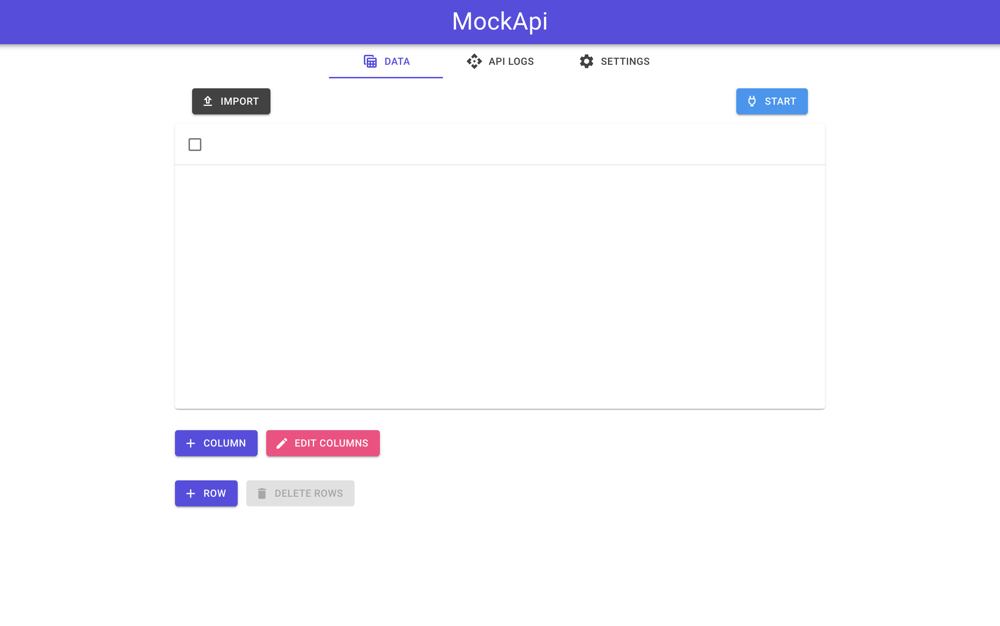
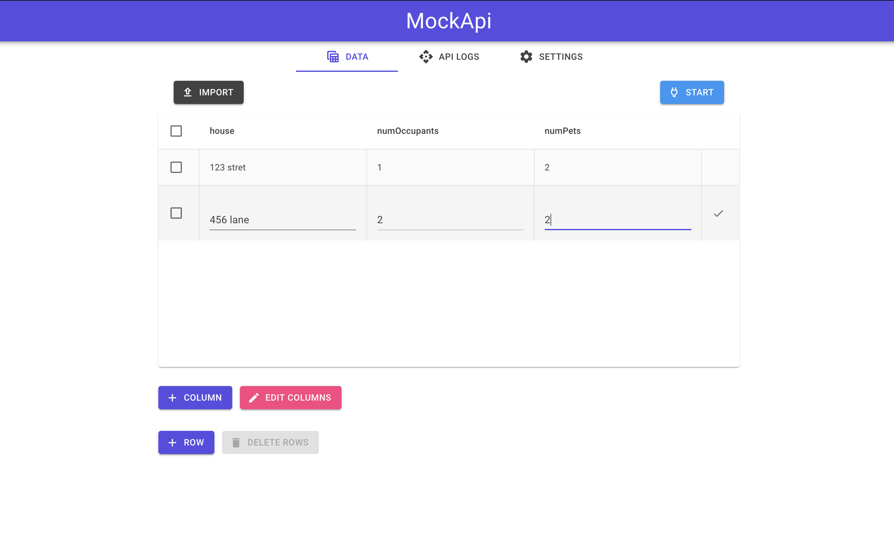
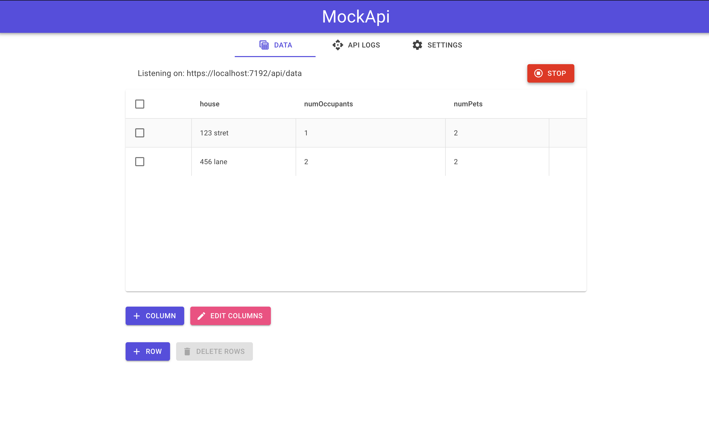

# Mock API

mock api is an application that allows you to import or create a csv file
and generate a simple api to use while testing/developing your application


## User Interface

### Inital application start
Presented with an empty table on when application first starts running




### Editing a row
Clicking on any cell in a row will allow you to edit it's value




### Api running
After pressing the 'Start' button the api will start listening and serving requests on the localhost port



from the above table, querying `https://localhost:7192/api/data/` would return a all rows as a json response
```json
{
  "id": "0",
  "house" : "123 street",
  "numOccupants" : "1",
  "numPets" : "2"
},
{
  "id" : "1",
  "house" : "456 lane",
  "numOccupants" : "2",
  "numPets" : "2"
}
```

a query to return all rows with 1 occupant: `https://localhost:7192/api/data/select?where=numOccupants&is=1`

would return 
```json
{
  "id": "0",
  "house" : "123 street",
  "numOccupants" : "1",
  "numPets" : "2"
}
```


## Data

All data returned from the api is in json format.

Data returned from the endpoint is as a json dictionary
eg. 
```json
{
  "id" : "1",
  "column1" : "value1",
  "column2" : "value2",
  "column3" : "value3"
}
```

the id key/value is the rows index in the table
this value is used when wanting to 
- get an individual row
- updating a row 
- deleting it 

## Endpoints


- **Get** `/api/data/`
  - returns all rows in the table


- **GET** `/api/data/:id`
  - returns the row with a matching id (the id is the rows index)


- **GET** `/api/data/select?where={column name}&is={value}`
  - searches rows for matching column/value pair, returns all rows that match
  - optional `limit` parameter to only return a set amount, by default all matching rows will be returned
  - eg. limit to 1 row: `/api/data/select?where={column name}&is={value}&limit=1`


**Endpoints to update, delete and create rows are in development**


## MVF

- [X] Crud column 
  - [X] create
  - [X] read
  - [X] update
  - [X] delete
  
- [x] Crud row
  - [X] create
  - [X] read
  - [X] update
  - [X] delete
  
- [x] Get data endpoints
  - [x] return all endpoint
  - [x] select endpoint
  - [x] return by id endpoint


## Future improvements

- implement an inbuilt route tester/generator 
